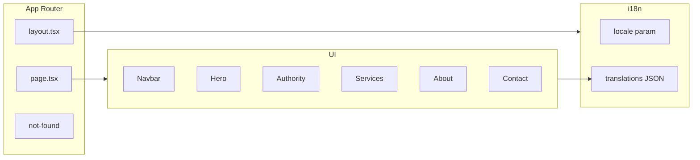

# Tbilisi AI

Repositório destinado à Tbilisi Automations — landing page SaaS com automação em IA (Next.js 14, Tailwind CSS, Framer Motion, i18n PT/EN).

## Getting Started

Run the development server:

```bash
npm run dev
# or
yarn dev
# or
pnpm dev
# or
bun dev
```

Open [http://localhost:3000](http://localhost:3000). The app redirects to `/pt-BR` by default; use `/en` for English. Use the language switcher in the navbar to toggle.

## Learn More

To learn more about Next.js, take a look at the following resources:

- [Next.js Documentation](https://nextjs.org/docs) - learn about Next.js features and API.
- [Learn Next.js](https://nextjs.org/learn) - an interactive Next.js tutorial.

You can check out [the Next.js GitHub repository](https://github.com/vercel/next.js) - your feedback and contributions are welcome!

## Deploy on Vercel

The easiest way to deploy your Next.js app is to use the [Vercel Platform](https://vercel.com/new?utm_medium=default-template&filter=next.js&utm_source=create-next-app&utm_campaign=create-next-app-readme) from the creators of Next.js.

Check out our [Next.js deployment documentation](https://nextjs.org/docs/app/building-your-application/deploying) for more details.
---
name: SaaS Landing Page Plan
overview: Scaffold a Next.js 14 App Router project with Tailwind CSS and Framer Motion, implement a simple i18n layer for PT/EN, and build a premium minimalist landing page with Navbar, Hero, Authority, Services, About, and Contact sections—all with prism gradient accents and smooth animations.
todos: []
isProject: false
---

# Modern SaaS Landing Page – Implementation Plan

## Current state

- Workspace contains only [README.md](README.md). The project will be created from scratch.

## Architecture overview




---

## 1. Project setup

- **Initialize Next.js 14** with App Router, TypeScript, Tailwind CSS, ESLint, `src/` directory, and no `app/` alias.
- **Install**: `framer-motion`.
- **Tailwind config**: Extend theme with:
  - **Colors**: `primary` gradient stops `#7B61FF`, `#00C2FF`, `#00E5A8`; `background: #FFFFFF`; `text: #1A1A1A`; `muted: #F5F7FA`.
  - **Background image** (optional): `gradient-to-r from-[#7B61FF] via-[#00C2FF] to-[#00E5A8]` for prism accents.
- **Global CSS**: Base styles, smooth scroll (`scroll-behavior: smooth`), and utility classes for gradient text/glow if needed.

---

## 2. Internationalization (i18n)

- **Strategy**: URL-based locale. Routes: `/[locale]/...` (e.g. `/en`, `/pt-BR`). Root `/` redirects to a default locale (e.g. `pt-BR` or `en`).
- **Locales**: `en`, `pt-BR`. Validate locale in middleware or `generateStaticParams`.
- **Translation files**: JSON under `src/i18n/` or `src/dictionaries/`:
  - `en.json` and `pt-BR.json` with namespaced keys for: `nav`, `hero`, `authority`, `services`, `about`, `contact`, `common`.
- **Helper**: `getDictionary(locale)` that reads the JSON and returns the object. No external i18n library.
- **Usage**: In server components, `const t = await getDictionary(params.locale)` and pass `t` to client components that need it; or pass only the needed slice (e.g. `hero: t.hero`) to avoid sending the whole dictionary to the client.

---

## 3. App structure and routing

- **Layout**: `src/app/[locale]/layout.tsx` — wraps children with optional font (e.g. Inter or system-ui), sets `lang` from `params.locale`, and renders a shared **Navbar** (client component) + main content.
- **Page**: `src/app/[locale]/page.tsx` — single page that renders: Hero, Authority, Services, About, Contact (each as a section with an `id` for anchor links).
- **Root**: `src/app/page.tsx` — redirect to default locale (e.g. `redirect('/pt-BR')` or `/en`).
- **Middleware** (optional): Detect locale from `Accept-Language` or cookie and redirect; otherwise keep logic in layout/page.

---

## 4. Design system (Tailwind + Framer Motion)

- **Gradient accents**: Use `bg-gradient-to-r from-[#7B61FF] via-[#00C2FF] to-[#00E5A8]` for highlights, underlines, or thin decorative elements. Optional soft glow: `shadow-[0_0_40px_rgba(123,97,255,0.15)]` and similar for blue/aqua.
- **Background**: White `#FFFFFF` for main; `#F5F7FA` for alternating sections (e.g. Authority, Contact).
- **Text**: `#1A1A1A` for body/headings; gray for secondary text.
- **Motion**: Framer Motion for:
  - Navbar: light fade/slide on mount; optional shrink on scroll.
  - Hero: staggered fade-up for headline, subheadline, and CTAs; subtle scale or opacity on background grid/dots.
  - Sections: `whileInView` fade-up with small `y` and `opacity`; optional stagger for cards.
  - Buttons/cards: `whileHover` / `whileTap` (scale 1.02, subtle shadow).
- **Accessibility**: Sufficient contrast (dark gray on white); focus rings on interactive elements; semantic HTML (nav, main, section, headings order).

---

## 5. Components (reusable, clean structure)


| Component            | Location                                | Purpose                                                                                                                                                         |
| -------------------- | --------------------------------------- | --------------------------------------------------------------------------------------------------------------------------------------------------------------- |
| **Navbar**           | `src/components/layout/Navbar.tsx`      | Logo (text), nav links (Home, Services, About, Contact), language switcher (PT                                                                                  |
| **LanguageSwitcher** | `src/components/LanguageSwitcher.tsx`   | Toggles between `/pt-BR` and `/en`; keeps current path, only changes locale.                                                                                    |
| **Hero**             | `src/components/sections/Hero.tsx`      | Headline, subheadline, two CTAs (primary + secondary), optional grid/dots background (CSS or small canvas/SVG). Receives `t.hero`.                              |
| **Authority**        | `src/components/sections/Authority.tsx` | Three metric cards: "20M+ Views", "100+ Automations Delivered", "Trusted by Businesses". Card layout; labels/numbers from `t.authority`.                        |
| **Services**         | `src/components/sections/Services.tsx`  | Four cards with icon + title: AI Chatbots, Workflow Automation, CRM Integrations, Lead Generation Systems. Icons: simple SVG or Lucide/heroicons. `t.services`. |
| **About**            | `src/components/sections/About.tsx`     | One short paragraph (authority/personal); professional tone. `t.about`.                                                                                         |
| **Contact**          | `src/components/sections/Contact.tsx`   | Form: Name, Email, Message; submit CTA "Schedule a Consultation". Client component; optional `action` for Server Action or API route later. `t.contact`.        |
| **Button**           | `src/components/ui/Button.tsx`          | Primary (gradient or solid) and secondary (outline) variants; Framer Motion hover/tap.                                                                          |
| **Section**          | `src/components/ui/Section.tsx`         | Optional wrapper for consistent padding and max-width.                                                                                                          |


- **Icons**: Either inline SVG in Services (and Navbar if needed) or add `lucide-react` for consistency; plan assumes small inline SVGs or one icon set to avoid scope creep.

---

## 6. Section and copy mapping

- **Navbar**: `nav.home`, `nav.services`, `nav.about`, `nav.contact`, `nav.bookCall`; LanguageSwitcher only needs locale route, no copy.
- **Hero**: `hero.headline`, `hero.subheadline`, `hero.ctaPrimary`, `hero.ctaSecondary` (EN/PT as specified).
- **Authority**: `authority.metric1`, `authority.metric2`, `authority.metric3` (and optional short labels).
- **Services**: `services.title`, `services.items[]` with `title` (and optional short description); icons mapped by key.
- **About**: `about.paragraph` (one block of text).
- **Contact**: `contact.title`, `contact.name`, `contact.email`, `contact.message`, `contact.submit`.

---

## 7. File and folder structure (concise)

```
src/
  app/
    [locale]/
      layout.tsx
      page.tsx
    page.tsx          # redirect to default locale
    globals.css
  components/
    layout/
      Navbar.tsx
    sections/
      Hero.tsx
      Authority.tsx
      Services.tsx
      About.tsx
      Contact.tsx
    ui/
      Button.tsx
      Section.tsx
    LanguageSwitcher.tsx
  i18n/
    getDictionary.ts
    en.json
    pt-BR.json
  lib/
    constants.ts       # locales list, default locale
public/                # favicon, etc.
tailwind.config.ts
next.config.js
package.json
```

---

## 8. UX checklist

- Smooth scrolling: `scroll-behavior: smooth` in globals; anchor links use `#services`, `#about`, `#contact`.
- Hover: Buttons and cards with Framer Motion or Tailwind hover states.
- Responsive: Mobile-first; Navbar collapses to hamburger menu on small screens (optional in v1: stacked or drawer).
- Contrast: Dark gray on white; gradient used for accents, not long body text.

---

## 9. Implementation order (recommended)

1. Next.js + Tailwind + Framer Motion setup; Tailwind theme and globals.
2. i18n: `getDictionary`, `en.json`, `pt-BR.json`; locale routing and root redirect.
3. Layout and Navbar (with LanguageSwitcher); locale-aware links.
4. Hero section (copy + CTAs + background).
5. Authority, Services, About, Contact sections and translations.
6. Button and Section UI components; polish motion and responsive behavior.
7. Contact form markup (and optional Server Action stub).
8. Final pass: accessibility, contrast, and performance (e.g. no layout shift).

---

## 10. Out of scope (for later)

- Backend for contact form (can add a Server Action or API route later).
- Blog or other pages.
- Cookie/localStorage for persisting locale preference (can be added after URL-based i18n works).

This plan yields a single, well-structured Next.js 14 landing page with Tailwind, Framer Motion, and simple i18n, ready for content tweaks and form backend when needed.